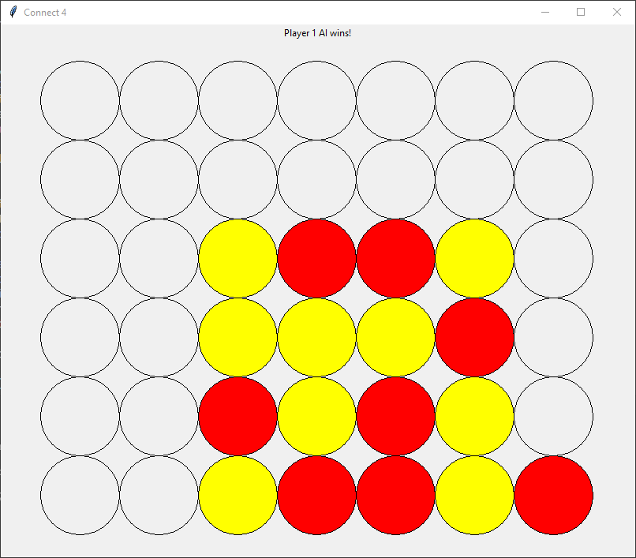

# Connect Four

An implementation of Connect Four playable by humans, AI, or a mix of both. The AI uses the Minimax or Expectimax algorithms to choose moves with Alpha-Beta pruning to improve performance.

## Overview

Players take turns to choose a column to drop their token into where it will rest on top of any other tokens in the column. The first player to match 4 or more of their tokens in a row, horizontally, vertically, or diagonally, wins.

<p align="center">
    
</p>

The possible types of players are Human, Random, and AI. Their logic is defined in [Player.py](Player.py). The game logic is in [ConnectFour.py](ConnectFour.py).

## Setup

### Dependencies

* Python3
* Numpy

### Running

```
$ python3 ./ConnectFour.py -h
usage: ConnectFour.py [-h] [-d] [--time TIME] {ai,random,human} {ai,random,human}

positional arguments:
  {ai,random,human}
  {ai,random,human}

optional arguments:
  -h, --help         show this help message and exit
  -d, --debug        Enable debug info for AI
  --time TIME        Time to wait for a move in seconds (int)
```

## Design

To calculate its next move the AI uses the Minimax algorithm and Alpha-Beta pruning if playing against a human or another AI. It uses Expectimax if playing against a random player. These algorithms perform a depth-first search of possible moves for the agent to make along with its opponent. Minimax assumes the opponent will always make the optimal move from its perspective while Expectimax allows for some amount of sub-optimal play.

The AI traverses 3 levels deep in the graph before performing a heuristic analysis of the game state based on how many contiguous tokens are on the board.

Alpha-Beta pruning is an enhancement to Minimax to improve performance that allows parts of the search graph to be pruned if a better move has already been found.

## Acknowledgements

This project was completed as part of coursework for [CSE 140: Artificial Intelligence](https://courses.soe.ucsc.edu/courses/cse140).

## Links

* [Minimax](https://en.wikipedia.org/wiki/Minimax)
* [Alpha-Beta Pruning](https://en.wikipedia.org/wiki/Alpha%E2%80%93beta_pruning)